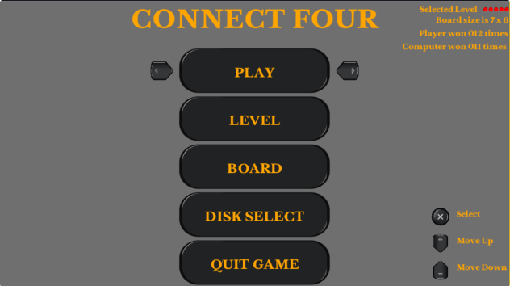
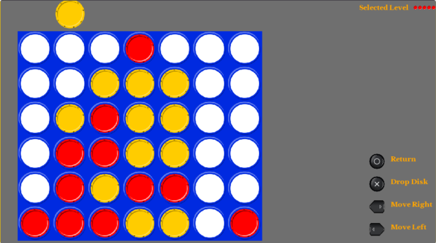

# Connect Four

## How to play:
 <kbd>Dpad</kbd> - Selection \
 <kbd>Cross</kbd> - Select \
 <kbd>Circle</kbd> - Return \

## Screenshots
 
 

## Known Bugs

- Fuzzy texts.
- Tell me.

## Future Plans

- Add sound /  gametrack
- Improve score logic to make Minimax algorithm better

## Special Thanks to:

Vitadev Package manager for releasing the SDK
captaincrunch80 <http://opengameart.org/users/captaincrunch80> for publishing/sharing .ogg sounds
I would like to thank the developers of Vita3K to help me create my content at a faster pace.
